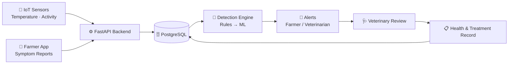
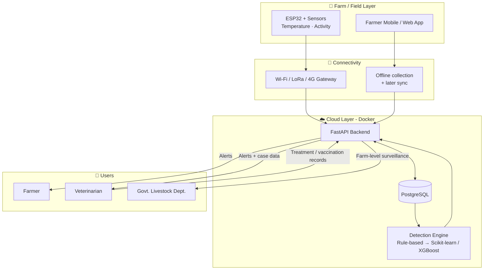

  

<h1 align="center">🐄 Case Tracer</h1>
<h3 align="center">Smart Livestock Health Monitoring and Early Disease Detection System</h3>

  
  
  
  
  

---

## 📌 Table of Contents

1. [Project Overview](#-project-overview)
2. [Problem Statement](#-problem-statement)
3. [Proposed Solution](#-proposed-solution)
4. [System Workflow](#-system-workflow)
5. [Tech Stack](#-tech-stack)
6. [System Architecture](#-system-architecture)
7. [Implementation Roadmap](#-implementation-roadmap)
8. [Feasibility, Risks & Mitigation](#-feasibility-risks--mitigation)
9. [Impact & Benefits](#-impact--benefits)
10. [Innovation & Uniqueness](#-innovation--uniqueness)
11. [References](#-references)
12. [Team](#-team)

---

## 🔎 Project Overview

**Case Tracer** is a software-first platform that combines **IoT sensing**, **AI/ML risk analysis** and **digital veterinary records** to help farmers and veterinarians detect livestock health problems earlier, act faster and track outbreaks across a farm.

| Field | Details |
|---|---|
| **Hackathon** | Smart India Hackathon 2026 |
| **Problem Statement ID** | SIH26128 |
| **Problem Statement Title** | Efficient systems for early detection, prevention, and management of livestock diseases and animal health issues |
| **Theme** | MedTech / BioTech / HealthTech |
| **PS Category** | Software |
| **Team ID** | 152487 |
| **Team Name** | Case Tracer |

---

## ❗ Problem Statement

Livestock diseases are often noticed only after visible symptoms worsen, which delays treatment and allows infections to spread across a farm. Health data is scattered, vaccination and treatment records are rarely digital, and veterinarians often lack timely, data-backed information to assess a case.

Case Tracer addresses this by making animal health **continuously observable, recorded and actionable**.

---

## 💡 Proposed Solution

- **Continuous digital health monitoring**: IoT sensors capture temperature, activity and health data, and farmers can report visible symptoms through an app.
- **AI/ML analysis**: health patterns and risks are analysed, with automated alerts to farmers and veterinarians.
- **Digital health records**: vaccination and treatment history is maintained for every animal.

**How it addresses the problem**

- Flags abnormal conditions earlier and supports preventive care and timely action.
- Helps identify possible disease outbreaks across the farm.

> **Design principle:** start with rule-based alerts, then introduce ML only after collecting validated veterinary data. Risk alerts *support* veterinary assessment; treatment remains a veterinary decision.

---

## 🔄 System Workflow

| Step | Stage | Description |
|---|---|---|
| 1 | **Data Collection** | Livestock IoT sensors and the farmer app capture health and symptom data |
| 2 | **FastAPI Backend** | Receives the data and stores it in PostgreSQL |
| 3 | **Disease Detection** | The detection engine runs risk analysis |
| 4 | **Alert** | Farmer and/or veterinarian is notified |
| 5 | **Health Record** | Treatment and health record is updated |

The same flow as an interactive diagram (renders on GitHub):

---

## 🧰 Tech Stack

| Layer | Technology | Purpose |
|---|---|---|
| **Frontend** | React / TypeScript | Farmer and veterinarian web/mobile interface (simple, multilingual) |
| **Backend** | Python / FastAPI | REST APIs, data ingestion, alert logic |
| **Database** | PostgreSQL | Animal profiles, sensor readings, health and vaccination records |
| **IoT** | ESP32 + health / activity sensors | On-animal data capture |
| **AI / ML** | Scikit-learn / XGBoost | Health risk analysis and outbreak monitoring |
| **Communication** | Wi-Fi / LoRa / 4G | Sensor-to-cloud connectivity (needs compatible gateways/modules) |
| **Deployment** | Cloud + Docker | Multi-farm, containerised deployment |

---

## 🏗️ System Architecture

---

## 🗺️ Implementation Roadmap

| Phase | Goal |
|---|---|
| **Phase 1** | Rule-based thresholds prototype |
| **Phase 2** | Collect veterinary-labelled data |
| **Phase 3** | ML models + prospective validation |

---

## ⚖️ Feasibility, Risks & Mitigation

**Why it is feasible**

1. Commercially available IoT components and mobile/web access.
2. Cloud architecture supports multiple farms and modular sensor expansion.
3. Rule-based detection first, followed by ML using validated health data.

| ⚠️ Potential Challenge / Risk | ✅ Mitigation Strategy |
|---|---|
| Sensor accuracy and maintenance | Calibration and periodic maintenance |
| Limited rural internet connectivity | Offline collection and later synchronisation |
| Insufficient quality health datasets | Models built using validated veterinary data |
| False alerts | Human/veterinary review of critical alerts |
| Farmer adoption and usability | Simple multilingual mobile interface |

---

## 🌍 Impact & Benefits

**Who benefits**

| Stakeholder | Benefit |
|---|---|
| **Farmers** | Early alerts on animal health issues |
| **Veterinarians** | Faster, data-backed case assessment |
| **Dairy & livestock farms** | Farm-level disease monitoring |
| **Animal-health organisations** | Better access to health information |
| **Government livestock departments** | Support for disease surveillance |

**Benefits of the solution**

| 🤝 Social | 💰 Economic | 🌱 Environmental |
|---|---|---|
| Healthier livestock | Fewer avoidable losses | Timely action helps limit disease spread |
| Better access to health information | Better productivity management | Responsible livestock management |
| Faster veterinary intervention | Better monitoring may reduce unnecessary treatment | Farm-level disease surveillance |

> *Expected benefits are subject to field evaluation. Treatment remains a veterinary decision.*

---

## ✨ Innovation & Uniqueness

- **IoT + AI/ML + veterinary records combined** in one platform.
- A **digital health profile for every animal**.
- **Real-time risk alerts** and farm-level outbreak monitoring.
- A **staged, validation-first approach**: rules first, ML once validated veterinary data exists.

---

## 📚 References

| Source | Link |
|---|---|
| WOAH: Animal Health Standards (codes and manuals) | https://www.woah.org/en/what-we-do/standards/codes-and-manuals/ |
| FAO: Animal Health (prevention, surveillance and early warning) | https://www.fao.org/animal-health/en |
| ICAR (India): Animal Science Division | https://icar.org.in/en/animal-science-division |
| Schulthess et al. (2024): LoRa cattle monitoring | https://arxiv.org/abs/2406.06245 |
| Pillai & Nazir (2025): CattleSense, IoT multisensor cattle monitoring | https://arxiv.org/abs/2509.12617 |
| Lee & Seo (2021): Wearable Wireless Biosensor Technology (cattle monitoring review) | - |

> Research references provide background and do not demonstrate validation of this proposed prototype.

**Demo:** [github.com/hakashkumar20-glitch/demo](https://github.com/hakashkumar20-glitch/demo)

---

## 👥 Team

| | |
|---|---|
| **Team Name** | Case Tracer |
| **Team ID** | 152487 |
| **Hackathon** | Smart India Hackathon 2026 |

---

   
  Built for Smart India Hackathon 2026

